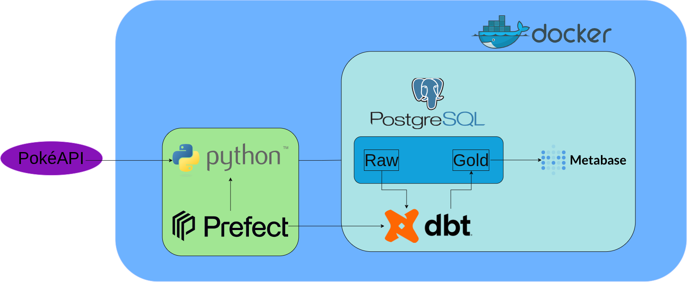
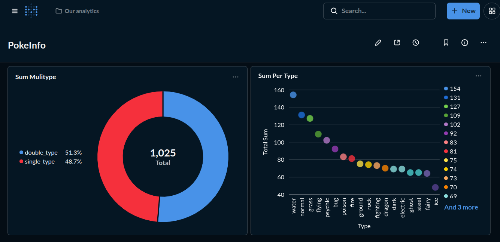

# ⚡ PokeData
> A data engineering project focused on the complete ELT lifecycle, from API ingestion to final visualization.

[](#)

## 📐 Architecture Diagram


## 🏗️ Architecture & Stack
The project is containerized with **Docker** and follows a modern data stack approach:

- **Python (httpx/pandas):** Extraction from PokeAPI and loading into the database.
- **PostgreSQL:** Primary Data Warehouse.
- **dbt (data build tool):** Data transformation, documentation, and testing.
- **Metabase:** BI Layer for dashboards and insights.
- **Docker & Docker-compose:** Infrastructure orchestration.

## 🚀 Key Features
- **Automated Ingestion:** Python scripts to fetch and normalize data.
- **Data Modeling:** Modular SQL transformations using dbt.
- **Visualization:** Interactive dashboards showing Pokémon attributes, types, and stats distributions.

## 🛠️ How to Run (TBA)
Look for a file named ".env.example" and rename it to ".env". Then add your username, password and name for your db
For exemple:
```
DB_USER=yourusername
DB_PASS=yourpassword
DB_NAME=yourdatabasename
DB_HOST=localhost
DB_PORT=5432
```

Go into dbt/ file and look for a file named "profiles.yml.exemple" and complete with the same information as you did on previously step.
Exemple:
```
pokedata:
  outputs:

    dev:
      type: postgres
      threads: 1
      host: db
      port: 5432
      user: yourusername
      pass: yourpassword
      dbname: yourbankname
      schema: public

  target: dev
```
After that run on your shell in sequence
```
docker compose up -d
python3 -m venv venv && source venv/bin/activate
pip install -r requirements.txt
cd python/ && python3 main.py
```

After all of that, you can look into Metabase, port 3000, log in with the same info from your "profile.yml" file. Click in create new question and select the "Gold" tables, which are ready to be put into graphs

---
## 📈 Insights Preview

